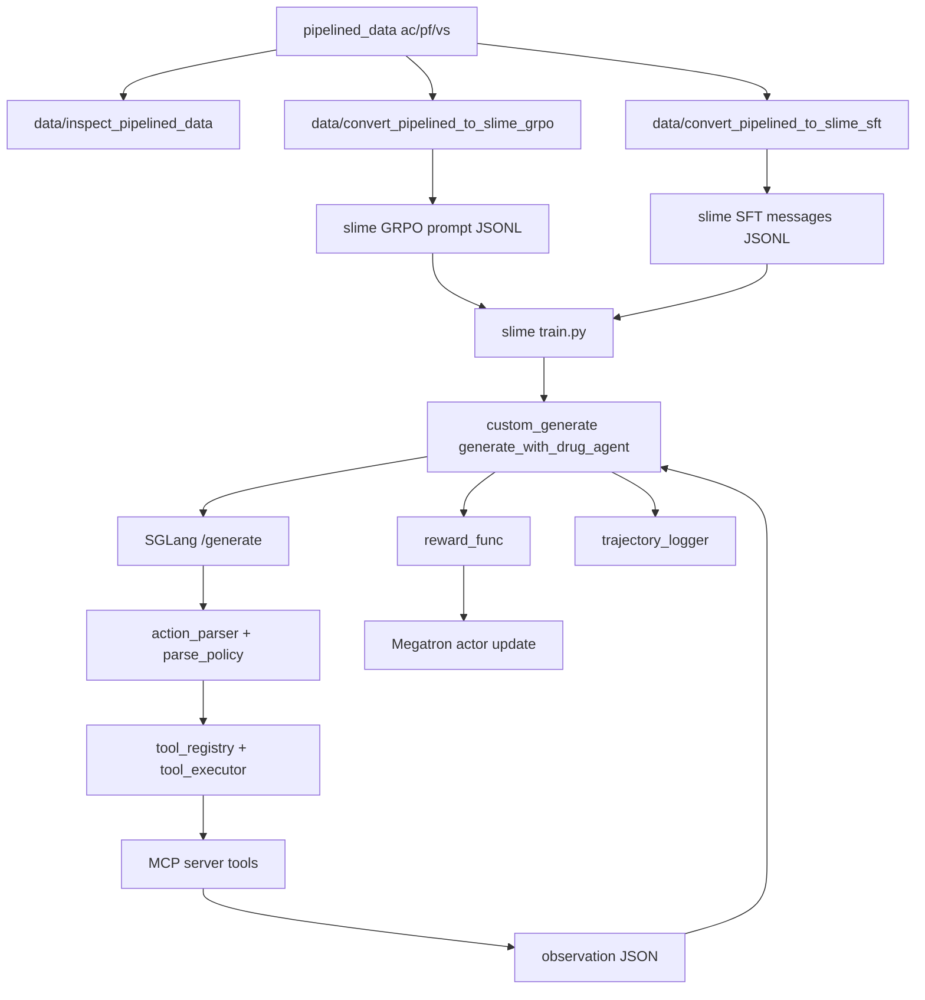

# Drug Agent 项目深度技术文档（slime 原生训练插件层）

- 生成日期: 2026-06-01
- 文档范围: slime/drug_agent 全量代码阅读与训练路径审计
- 目标读者: 新接手研发/训练人员、合规审计人员、模型工程与工具链维护者
- 重要声明: 本文不启动训练、不修改核心逻辑，仅基于代码现状进行说明与审计

## 1. 项目定位与边界（必须明确）

### 1.1 这个项目是什么

drug_agent 是一个位于 slime 仓库中的“**训练插件层**”，目标是在 **slime 原生训练栈** 上落地 MolClaw 药筛智能体训练流程，实现：

- 数据检查与转换（pipelined_data -> slime SFT/GRPO JSONL）
- MCP 工具调用驱动的在线 rollout
- 自定义 reward 计算
- 轨迹级可审计日志
- 可直接运行的 SFT / PPO / GRPO 脚本入口

它的核心原则不是“重写训练框架”，而是复用 slime 原生接口，作为一个可插拔插件层运行。

### 1.2 它为什么放在 slime 仓库下

- 训练实际运行在 slime 原生 train.py / SGLang rollout / Megatron actor 之上
- 需要使用 slime 提供的 custom_generate / custom_rm / custom_rollout_log hook
- 训练端最小侵入：所有新逻辑集中在 drug_agent 目录，不改 slime core

### 1.3 与 verl-agent / MolClaw / MCP / pipelined_data 的关系

- pipelined_data: 既有 MolClaw 轨迹数据来源，drug_agent 只做转换与审计
- MCP server: 工具真实执行端（MolClaw 工具集），drug_agent 负责调用与语义判断
- verl-agent: 历史工程基础，但此项目**不迁移**其训练主干逻辑

### 1.4 必须明确写出（项目边界）

本项目不是重新实现 trainer。  
本项目不是迁移 verl-agent 的 EnvManager/VectorEnv/trainer adapter。  
本项目是在 slime 原生 train.py/custom_generate/custom_rm/SGLang/Megatron 之上实现一个 drug-agent 插件层。

### 1.5 目录入口与核心模块

- drug_agent/README.md: 总览与快速运行入口
- drug_agent/SLIME_DRUG_AGENT_RUNBOOK_zh.md: 分阶段运行手册与已有门禁记录
- drug_agent/protocol: action 协议与解析策略
- drug_agent/data: pipelined_data 检查、GRPO/SFT 转换、SFT 消息校验
- drug_agent/tools: MCP client / registry / executor / tool success 语义
- drug_agent/rollout: 自定义生成与 reward
- drug_agent/tools_debug: 诊断与门禁脚本
- drug_agent/scripts: SFT/PPO/GRPO 启动脚本

## 2. 总体架构与数据流（架构图）

### 2.1 高层架构图



### 2.2 模块职责简表

- data/*: 清洗与转换原始轨迹，生成训练可用 JSONL
- protocol/*: action 协议与严格/宽松解析策略
- tools/*: MCP 工具加载、参数校验、语义判定
- rollout/*: 在线多步生成、工具调用、观测回填、奖励计算、轨迹记录
- scripts/*: 标准化 SFT/PPO/GRPO 训练入口
- tools_debug/*: 不进训练的审计与门禁工具

## 3. 正式训练路径 vs Debug 路径（严格隔离）

### 3.1 正式训练路径

- 入口: scripts/run_qwen3_5_0_8b_drug_sft_smoke.sh / run_qwen3_5_0_8b_drug_ppo_smoke.sh / run_qwen3_5_0_8b_drug_grpo_smoke.sh / run_qwen3_5_0_8b_drug_grpo_learn.sh
- 训练默认严格：
  - DRUG_AGENT_ROLLOUT_MODE=train_strict
  - DRUG_AGENT_ALLOW_PARSE_RECOVERY=0
- 解析策略严格：不接受 markdown / XML / 文本包裹 JSON
- 解析失败直接生成 invalid_action observation，进入 reward 负反馈

### 3.2 Debug 路径

- 入口: tools_debug/debug_one_task.py / debug_replay_trajectory.py / debug_mcp_tools.py / debug_sglang_launch.py
- 默认 permissive：允许 parse recovery
- 目的: 诊断模型输出、工具连通、协议合规，不参与训练 reward

### 3.3 Debug permissive 为什么不能进入正式训练

- parse recovery 会从自然语言中提取 JSON 并继续执行工具
- 如果进入训练路径，会导致模型未遵守严格协议时仍获得正向反馈
- 正式训练的在线 rollout 必须确保 strict action-json 输出，否则 reward 会被污染
- ReAct-style tagged messages 属于 SFT 正式协议，不要和在线 rollout 的 action-json 混用

### 3.4 训练默认严格配置位置

- drug_agent/protocol/parse_policy.py: 默认 rollout_mode 为 train_strict
- scripts/run_qwen3_5_0_8b_drug_ppo_smoke.sh 与 run_qwen3_5_0_8b_drug_grpo_smoke.sh 显式导出 strict 变量

显式要求（正式训练）：

DRUG_AGENT_ROLLOUT_MODE=train_strict  
DRUG_AGENT_ALLOW_PARSE_RECOVERY=0

Debug 模式需要显式开启：

- DRUG_AGENT_ROLLOUT_MODE=debug_permissive
- 或 DRUG_AGENT_ALLOW_PARSE_RECOVERY=1

补充说明：

- parse_policy 中允许通过 DRUG_AGENT_ALLOW_PARSE_RECOVERY 覆盖 strict 模式
- 即使 DRUG_AGENT_ROLLOUT_MODE=train_strict，若显式设置 DRUG_AGENT_ALLOW_PARSE_RECOVERY=1，parse_recovery_enabled 仍会为 true
- 正式训练必须保持 DRUG_AGENT_ALLOW_PARSE_RECOVERY=0

## 4. Action Protocol（严格输出协议）

### 4.1 协议定义

- action 类型只有两种:
  - tool_call
  - final_answer
- 输出必须是**单一 JSON 对象**，不得附带任何文本

#### 合法 tool_call 例子

```json
{"type":"tool_call","tool_name":"is_valid_smiles","arguments":{"smiles_list":["CCO"]}}
```

#### 合法 final_answer 例子

```json
{"type":"final_answer","answer":{"summary":"...","evidence":[],"result":{},"ranked_molecules":[]}}
```

#### 不合法示例（正式训练应判为 invalid_action）

```text
我先调用一个工具。
{"type":"tool_call", ...}
```

```text
```json
{"type":"tool_call", ...}
```
```

```text
```text
{"type":"tool_call", ...}
```
```

### 4.2 解析器接受/拒绝规则

- 严格解析器: drug_agent/protocol/action_parser.py
  - 拒绝 markdown fenced JSON
  - 拒绝 XML 格式
  - 只接受完整 JSON object
- 宽松解析器: drug_agent/protocol/parse_policy.py
  - 仅在 debug 或显式允许时启用
  - 可从文本中提取嵌入 JSON（parse recovery）

### 4.3 strict 与 recovery 的差异

- strict: 只要不完全合法 JSON，就 invalid_action
- recovery: 从文本中抽取 JSON 进行恢复
- 正式训练默认 strict，debug 才允许 recovery

### 4.4 协议边界明确声明

- 是否允许 markdown: 不允许（严格模式直接拒绝）
- 是否允许 XML: 不允许
- 是否允许自然语言 + JSON: 严格模式不允许，debug recovery 可能抽取 JSON
- 是否允许代码块 ```json: 不允许
- 是否允许多段 JSON: 不允许（只允许单一 JSON object）

## 5. Prompt 设计与约束

### 5.1 system prompt

- 来源: drug_agent/constants.py 中 DEFAULT_SYSTEM_PROMPT
- 核心目标: 明确只输出 JSON、禁止 markdown/XML/自然语言包装

### 5.2 user prompt 构造

- 来源: drug_agent/protocol/prompts.py
- 输出格式: /no_think + JSON payload
- payload 关键字段:
  - task_id / task_type / instruction / inputs
  - allowed_tools
  - max_steps
  - required_action_format
  - output_constraints (json_only, no_markdown_code_fence, no_xml, single_json_object, enable_thinking false)

### 5.3 /no_think 与 enable_thinking=False

- Qwen3.5 默认可能启用推理模式，/no_think 与 enable_thinking=False 用于抑制推理文本
- 在在线 rollout 的 action-json 场景中，要求只输出 JSON 是正式协议的一部分
- 在 ReAct SFT 场景中，正式协议改为 tagged messages，不再是纯 JSON
- 不合规的是：模型输出不合规时被恢复并获得训练奖励

### 5.4 prompt 是否包含 schema

- 当前只包含 allowed_tools 列表
- 不包含每个工具的参数 schema
- 参数 schema 校验在工具执行前由 tool_registry 进行

### 5.5 rollout 额外约束提醒

- generate_with_drug_agent 会把 ROLLOUT_FORMAT_REMINDER 追加到 system 与最后一个 user 里
- 提示文本再次强调只输出 JSON 与禁止自然语言/markdown/XML
- apply_chat_template 尝试 enable_thinking=False，降低推理文本输出概率

## 6. Tool Registry / MCP Client / Schema 校验

### 6.1 工具列表加载

- drug_agent/tools/tool_registry.py
- registry.list_tools 调用 MCP list_tools
- 归一化工具名（去掉 mcp__ 前缀）
- 工具 schema 来源于 MCP list_tools 返回的 input_schema

### 6.2 allowlist 机制

- 默认 allowlist: drug_agent/tools/allowlist_v0.json
- 可用环境变量覆盖:
  - DRUG_AGENT_ALLOWLIST_PATH
  - DRUG_AGENT_ALLOW_ALL=1（debug only）

allowlist_v0 当前仅包含小型子集工具（17 个）。
运行时 MCP 可能提供更多工具（例如 81 个），但默认只允许 allowlist 内工具。needs_manual_review: MCP 工具总数需在运行时 list_tools 中确认。

补充：

- 每个样本的 env_kwargs.allowed_tools 也会参与校验
- allow_all 仅在 debug 阶段建议使用，正式训练不应开启

### 6.3 参数校验规则

- 仅做基础校验: required 字段 + 基本类型
- 不做参数 alias 自动修复
- 不做复杂结构与嵌套 schema 深校验
- action_parser 仅要求 tool_name 非空，不强制 mcp__ 前缀
- tool_registry 才负责 allowlist 与 registry 级别校验

必须强调：

不做参数 alias auto-fix。  
模型必须学习真实 MCP tool schema。  
参数错误进入 validation_failed，而不是 executor 自动修正。

### 6.4 MCP endpoint/key 管理

- 从环境变量读取:
  - MOLCLAW_SCP_SERVER_URL
  - MOLCLAW_SCP_API_KEY
- 不写入 dataset，避免密钥泄露

### 6.5 MCP 运行时行为

- MCPToolExecutor 内部独立线程事件循环
- connect/list_tools/execute 受超时参数控制
- 超时或异常会返回 transport_ok=false 的失败结果

## 7. Tool Success 语义（重点章节）

### 7.1 字段含义

- transport_ok: MCP 传输/调用是否成功
- tool_schema_valid: 本地 schema 基础校验是否通过
- tool_execution_success: transport_ok 且 schema_valid 且没有显式错误状态
- tool_semantic_success: 工具语义成功（status=success 等）
- semantic_unknown: 没有明确成功或失败状态
- tool_result.ok: 当前实现等价于 tool_semantic_success
- tool_result.ok 可能与 tool_execution_success 不一致（语义未知时执行成功但 ok=false）
- raw_payload: MCP 原始返回，通常保存在 tool_result.metadata.raw

### 7.2 语义判定逻辑（drug_agent/tools/tool_success.py）

- raw_payload.isError == true -> 语义失败
- parsed.status / parsed.result.status / parsed.structuredContent.status 命中 error -> 语义失败
- raw_payload.structuredContent.status 命中 error -> 语义失败
- status in success -> 语义成功
- status 缺失 -> semantic_unknown
  - 默认 unknown_as_failure=True -> tool_semantic_success=False
  - tool_execution_success 仍为 True（表示执行完成但语义未知）

### 7.3 validation_failed / transport_error / timeout 的处理

- validation_failed: make_validation_failed_result
  - transport_ok=False
  - tool_schema_valid=False
  - tool_execution_success=False
  - tool_semantic_success=False
- MCP transport error: tool_execution_success=False
- timeout: 由 MCPToolExecutor 视作 transport error

known_risk:

- validation_failed 由 make_validation_failed_result 生成，其中 transport_ok=False
- 本地参数校验失败被归类为 transport 失败，可能混淆统计语义

### 7.4 对 reward 与统计的影响

- tool_success_rate: 基于 num_tool_success / (num_tool_success + num_tool_error)
- tool_execution_success_rate: 基于执行尝试数（排除 schema fail）
- unknown status 被视为语义失败，降低 tool_success_rate
- tool_execution_success_rate 与 tool_success_rate 可能分离（语义未知仍计为执行成功）
- num_tool_error 会覆盖 schema fail 与语义失败两类情况

### 7.5 needs_manual_review

- MCP 返回结构是否稳定包含 status / structuredContent.status / isError 需要人工确认
- 若 MCP 工具不提供 status，可能大量进入 semantic_unknown
- `debug_training_compliance.py` 仅作 deprecated helper，不再作为正式训练或 SFT 门禁权威

## 8. Observation 设计

### 8.1 结构与序列化

- observation 以 JSON 字符串形式写入 user turn
- 格式:

```json
{"observation":{...}}
```

- generate_with_drug_agent 在 token 级追加 observation，并设置 loss_mask=0

### 8.2 observation 字段内容

- type: tool_result 或 invalid_action
- tool_result 包含:
  - ok / transport_ok / tool_schema_valid / tool_execution_success / tool_semantic_success / semantic_unknown
  - result / error / metadata / latency_sec
- invalid_action 包含:
  - error_type / error_message / raw_text

### 8.3 observation 内容来源与风险

- tool_result.metadata 可能包含 raw MCP 响应（含 isError/status）
- 目前 observation 未做长度截断，长结果可能导致上下文膨胀
  - known_risk: 超长 observation 影响 rollout 吞吐与上下文长度

### 8.4 作用

- 引导模型在下一步修正工具参数或补充缺失
- 训练时 observation 进入上下文，但不计 loss

### 8.5 典型纠错模式示例

- 第 1 步: 参数缺失 -> observation 返回 validation_failed
- 第 2 步: 模型补参数 -> 工具执行成功
- 第 3 步: 模型继续下一工具或 final_answer

## 9. GRPO / PPO Online Rollout 流程（正式训练）

### 9.1 流程分解

1. 脚本启动 Ray + slime train.py
2. train.py 使用 custom_generate_function_path
3. generate_with_drug_agent 组装 prompt
4. SGLang /generate 生成 JSON action
5. action_parser 严格解析
6. tool_registry 校验工具与参数
7. MCP 执行工具
8. observation 回写
9. reward_func 计算奖励
10. trajectory_logger 写入轨迹
11. Megatron actor 更新

补充细节：

- generate_with_drug_agent 调用 /generate 接口使用 input_ids 直接采样
- 如 SGLang 返回 token logprob，会回写 rollout_log_probs 供训练使用
- observation 以 loss_mask=0 追加，保证不参与 loss

### 9.2 输入输出与关键字段

- 输入: prompt(messages)、metadata(env_kwargs)、allowed_tools、max_steps
- 输出: Sample.response、Sample.tokens、Sample.metadata.drug_agent_trace
- Trace 中关键字段:
  - actions / observations
  - done_reason
  - num_invalid / num_tool_* / num_parse_recovery
  - strict_success_rate / recovery_success_rate
  - tool_execution_success_rate
  - 每步 action 记录 parse_source/parse_recovery 与原始输出

### 9.3 错误处理

- parse 失败 -> invalid_action + observation
- tool 校验失败 -> validation_failed -> observation
- MCP 调用失败 -> transport_error -> observation
- 超时/异常 -> fatal_error

### 9.4 trace 字段传递

- reward_func 读取 drug_agent_trace
- trajectory_logger 写入 trajectories.jsonl

## 10. SFT 训练流程

### 10.1 脚本入口

- scripts/run_qwen3_5_0_8b_drug_sft_smoke.sh
- 使用 slime 原生 sft_rollout + sft_loss

### 10.2 数据格式

- 输入: 上游 `pipeline/postprocess` 生成的 ReAct-style messages JSONL
- messages: list of {role, content, step_loss_mask}
- assistant content 采用 ReAct tagged 结构（`<thought>`, `<tool_call>`, `<observation>`, `<final_answer>`）
  - system 的 step_loss_mask 固定为 0
  - 其余 role 若缺失 step_loss_mask，默认 1

补充：SFT 后处理会清洗非 MCP 工具、fence wrapper 和无效片段，但保留真实的 ReAct 推理与工具序列；样本允许多次 tool_call / observation，不强制单轮。

### 10.3 关键规则

- system/user/assistant 角色规范化
- assistant 允许 thought/tool_call/observation/final_answer 的 ReAct 顺序
- user turn 继续承载 observation 文本，保持 Qwen3.5 chat template 兼容
- 保障 Qwen3.5 模板: 第一条非 system 必须是 user

补充：

- 非 system/user/assistant 角色统一转为 user
- content 非字符串会被 JSON 字符串化
- system 消息只保留第一条，其余降级为 user
- 默认不拆分多 tool_call；只有显式开启兼容开关才拆分

### 10.4 SFT 与工具调用关系

- SFT 本身不在线调用 MCP 工具，工具轨迹来自上游后处理
- SFT 不使用 reward_func
- SFT 不依赖在线 rollout
- RL / online rollout 仍保持 action-json 协议，不与 ReAct SFT 混用

### 10.5 与 GRPO/PPO 的 action protocol 一致性

- SFT assistant output 经过严格规范化
- 与 online rollout 的 action_parser 协议一致

## 11. Reward 设计

### 11.1 reward_func 输入输出

- 输入: Sample (含 drug_agent_trace 与 label)
- 输出: dict，包含 score / components / diagnostics
- score 被 train.py 作为 reward-key 消费

### 11.2 组件构成

- format_reward: JSON 格式合规奖励
- action_valid_reward: valid/strict 比例奖励
- tool_schema_reward: 参数 schema 合规奖励
- tool_execution_reward: 执行成功奖励
- tool_semantic_reward: 语义成功奖励
- parse_recovery_penalty: 宽松恢复惩罚
- progress_reward: 有效进展奖励
- final_reward: final_answer 质量奖励
- efficiency_reward: 步数与结束原因效率奖励

### 11.3 关键约束

reward 不能把 recovered action 当作 strict valid action。  
reward 不能把 transport success 当作 tool execution success。  
reward 不能把 validation_failed 当作 tool success。

当前实现中：

- parse_recovery_penalty 会显式扣分
- tool_execution_success 与 tool_semantic_success区分
- schema fail 与 transport error 被记为失败

### 11.4 diagnostics 字段

- num_invalid / num_parse_recovery
- strict_valid_count / recovered_valid_count
- num_tool_schema_error / num_tool_execution_success / num_tool_semantic_error
- num_transport_error / done_reason / status

## 12. Trajectory Logger / Trace

### 12.1 输出位置

- DRUG_AGENT_RUNS_ROOT/<run_name>/trajectories.jsonl

### 12.2 单行字段

- prompt / actions / observations / final_answer
- reward 与 components
- strict_success_rate / recovery_success_rate
- tool_execution_success_rate / tool_semantic_unknown_rate
- done_reason / sample_status

补充：trajectory_logger 会将汇总指标注入 rollout_extra_metrics，供训练日志展示。

### 12.3 summary row

- trajectory_logger 不写 summary 行
- debug_one_task 会追加 summary 行

### 12.4 trace 与 reward 的关系

- trace 是审计数据源
- reward 基于 trace 计算
- trace 不应替代 reward 逻辑

## 13. Debug 工具说明

### 13.1 debug_mcp_tools.py

- 目的: 检查 MCP 工具列表与单次调用
- 是否启动模型: 否
- 是否调用 MCP: 是
- 是否启动训练: 否
- 默认 permissive: 是（但不涉及 parse recovery）

### 13.2 debug_one_task.py

- 目的: 单样本在线 rollout 调试
- 是否启动模型: 可能（可选本地 SGLang）
- 是否调用 MCP: 是
- 是否启动训练: 否
- 默认 parse recovery: 是
- 输出: debug_one_task_trace.jsonl

### 13.3 debug_replay_trajectory.py

- 目的: 回放 SFT messages 的 tool_call
- 是否启动模型: 否
- 是否调用 MCP: 是
- 是否启动训练: 否
- 输出: replay_trace.jsonl

### 13.4 debug_sglang_launch.py / sglang_launcher.py

- 目的: 检测或启动 SGLang 服务
- 是否启动训练: 否
- 输出: sglang_drug_agent_debug.log

### 13.5 debug_training_compliance.py

- 目的: 离线合规审计
- 检查项:
  - parse 模式
  - tool success 语义
  - reward 组件完整性
  - SFT 严格消息校验
  - 训练默认 strict 配置
  - debug 代码隔离
- 输出: audit_report.json / audit_report.md
- 状态: deprecated helper，仅供回归参考

缺失文件说明：

- 需求清单中提到的 debug_parse_modes.py、debug_tool_success_semantics.py、debug_reward_semantics.py 在当前目录不存在
- 当前对应的历史检查视角仍可由 debug_training_compliance.py 辅助观察，但它已降级为 deprecated helper
- ReAct SFT 的正式协议检查请以 validate_sft_messages.py --protocol react_json 为准

## 14. Scripts（逐个说明）

### 14.1 check_env.sh

- 目的: 环境检查 (CUDA/CPU/路径)
- 不启动训练

### 14.2 run_qwen3_5_0_8b_drug_sft_smoke.sh

- 目的: SFT smoke
- 输入: sft/mixed.jsonl
- 不用 MCP
- 使用 slime 原生 sft_rollout + sft_loss
- 支持 SFT_DEBUG_TRAIN_ONLY
- 脚本内部启动 Ray head
- 不使用 custom_generate/custom_rm

### 14.3 run_qwen3_5_0_8b_drug_ppo_smoke.sh

- 目的: PPO smoke
- 需要 MCP env
- 设置 strict 环境变量
- 使用 custom_generate + reward_func + trajectory_logger
- 脚本内部启动 Ray head
- 不显式启动外部 SGLang，交由 slime rollout 逻辑管理

### 14.4 run_qwen3_5_0_8b_drug_grpo_smoke.sh

- 目的: GRPO smoke
- 需要 MCP env
- 设置 strict 环境变量
- 脚本内部启动 Ray head
- 不显式启动外部 SGLang，交由 slime rollout 逻辑管理

### 14.5 run_qwen3_5_0_8b_drug_grpo_learn.sh

- 目的: GRPO 放大训练
- 需要 MCP env
- 设置 strict 环境变量
- 脚本内部启动 Ray head
- 不显式启动外部 SGLang，交由 slime rollout 逻辑管理

## 15. 数据转换与字段说明

### 15.1 pipelined_data 输入

- ac/pf/vs 原始轨迹 JSONL
- sft_outputs_answer_hit
- molclaw_usage_summary.csv

### 15.2 GRPO 输出字段

- prompt: system+user prompt messages
- label: ground_truth + expected + metadata
- metadata: task_id/task_type/env_kwargs/usage_summary
- env_kwargs: allowed_tools/max_steps/task_id/task_type

补充：GRPO 转换逻辑要点

- 输入 join: rl_prompts + sft_outputs_answer_hit + raw trajectories + usage_summary
- instruction 优先取 question_text，其次 env_kwargs.task.instruction
- allowed_tools 会被 allowlist 过滤，过滤后为空则样本跳过
- label.metadata 中记录 raw 轨迹路径、usage_summary、sft metadata 等

### 15.3 SFT 输出字段

- messages: system/user/assistant list
- metadata: task_id/task_type/source_path/tool_call_count/final_answer_count

补充：

- metadata.schema_version=drug_agent_sft_v2
- usage_summary 追加在 metadata 里供审计

### 15.4 skipped_report

- 每条样本跳过原因
- 作为数据审计依据

## 16. 已验证门禁（现有记录）

以下门禁结果来源于 runbook 记录与人工复现日志，需进一步审计确认：

- slime 官方 smoke 已通过
- Qwen3.5-0.8B GRPO/ReTool smoke 已通过
- MCP list-tools 可用
- is_valid_smiles schema 调用成功
- 27B SGLang server 常驻可用
- debug_one_task 单样本 rollout 可用
- 27B batch 10 条 rollout 可用
- action_valid_rate=1.0
- final_answer 7/10
- tool_success_rate ~0.28

needs_manual_review: 建议在真实日志中再次核验这些指标。

## 17. 已知风险与待确认点

### 17.1 风险清单

- strict/recovery 是否在所有训练入口完全隔离（需审计 runtime env 传递）
- tool success 语义依赖 MCP 返回 status/isError，未知字段可能导致 semantic_unknown
- pred_binding_affinity_boltz2 等参数 schema 复杂，对小模型友好度低
- MCP 工具延迟高，在线 RL 吞吐风险
- SFT 数据是否全量符合 ReAct-style tagged protocol（需 validate_sft_messages 输出确认）
- reward 粒度是否足够驱动正确工具使用
- 0.8B 是否能从 27B/122B 轨迹学会工具调用
- 27B debug success 不代表 0.8B 训练成功
- 122B/27B 只适合 teacher/debug，不应直接当训练 actor

### 17.2 标记规则

- needs_manual_review: 需要人工或外部日志确认
- 不合规风险: 会直接污染训练或违反协议

## 18. 正式训练前 checklist

- [ ] validate_sft_messages react_json passed
- [ ] debug_training_compliance treated as deprecated helper
- [ ] tool_success semantics checked
- [ ] DRUG_AGENT_ROLLOUT_MODE=train_strict
- [ ] DRUG_AGENT_ALLOW_PARSE_RECOVERY=0
- [ ] Ray runtime env contains strict settings
- [ ] no 27B SGLang process occupying GPU
- [ ] MCP env loaded
- [ ] SFT smoke command ready
- [ ] GRPO smoke command ready

## 19. 推荐后续路线

1. 完成训练合规审计
2. 停 27B SGLang
3. 跑 0.8B SFT smoke
4. 跑 0.8B GRPO smoke
5. 再考虑 PPO smoke
6. 用 27B/122B 生成更高质量 SFT trajectories
7. 逐步扩大 ac/pf/vs 和工具集合

## 20. 附录：环境变量与默认值

- DRUG_AGENT_ALLOWLIST_PATH: allowlist 文件路径
- DRUG_AGENT_ALLOW_ALL: 是否绕过 allowlist
- DRUG_AGENT_ROLLOUT_MODE: train_strict / debug_permissive
- DRUG_AGENT_ALLOW_PARSE_RECOVERY: 0/1
- DRUG_AGENT_UNKNOWN_SEMANTIC_AS_FAILURE: 默认 1
- DRUG_AGENT_RUN_NAME: 轨迹输出目录名
- OUTPUTS_ROOT / DRUG_AGENT_DATA_ROOT / DRUG_AGENT_RUNS_ROOT
- MOLCLAW_SCP_SERVER_URL / MOLCLAW_SCP_API_KEY
- MOLCLAW_CONNECT_TIMEOUT_SEC / MOLCLAW_LIST_TOOLS_TIMEOUT_SEC / MOLCLAW_TOOL_TIMEOUT_SEC / MOLCLAW_TOOL_HEARTBEAT_SEC

## 21. 附录：协议与 observation 示例

### 21.1 tool_call

```json
{"type":"tool_call","tool_name":"is_valid_smiles","arguments":{"smiles_list":["CCO"]}}
```

### 21.2 final_answer

```json
{"type":"final_answer","answer":{"summary":"...","evidence":[],"result":{},"ranked_molecules":[]}}
```

### 21.3 observation（工具成功）

```json
{"observation":{"type":"tool_result","tool_name":"is_valid_smiles","ok":true,"result":{"status":"success"},"error":null,"latency_sec":0.12,"transport_ok":true,"tool_schema_valid":true,"tool_execution_success":true,"tool_semantic_success":true,"semantic_unknown":false,"metadata":{}}}
```

### 21.4 observation（validation_failed）

```json
{"observation":{"type":"tool_result","tool_name":"is_valid_smiles","ok":false,"result":null,"error":{"type":"ToolValidationError","message":"missing_required_argument:smiles_list"},"latency_sec":0.0,"transport_ok":false,"tool_schema_valid":false,"tool_execution_success":false,"tool_semantic_success":false,"semantic_unknown":false,"metadata":{"tool_reason":null,"args_reason":"missing_required_argument:smiles_list"}}}
```

### 21.5 invalid_action

```json
{"observation":{"type":"invalid_action","error_type":"ActionJSONDecodeError","error_message":"invalid JSON: ...","raw_text":"..."}}
```
